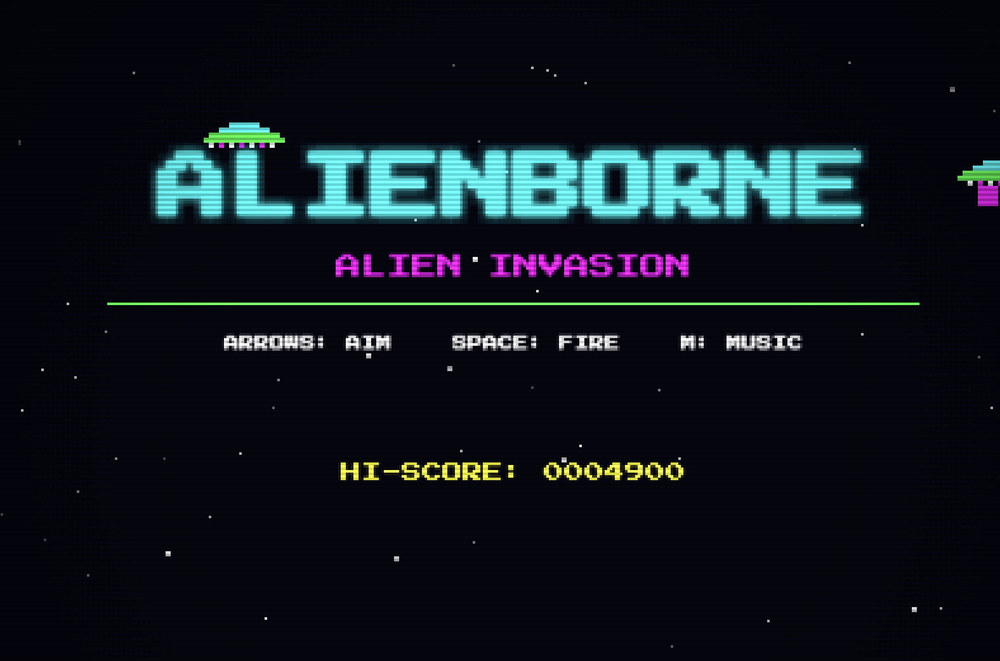

# ALIENBORNE



A retro arcade alien invasion game for the browser, inspired by the classic Apple II game *Airborne!*

**"1982 arcade cabinet meets alien invasion."**

---

## Gameplay

Alien ships fly horizontally across the screen in two lanes, periodically dropping invaders toward the ground. You control a cannon at the bottom of the screen — rotate it and shoot before the aliens land. If enough aliens reach the ground your base is overwhelmed and it's game over.

Every few kills a **Mothership** enters the field. It's larger, takes more hits, drops aliens faster, and explodes with a screen-shaking multi-burst when destroyed.

When your base health drops below 75%, ships occasionally drop a **health pack** instead of an alien. Shoot it to recover 25% health.

---

## Controls

| Key | Action |
|-----|--------|
| `←` / `→` | Rotate cannon |
| `Space` | Fire |
| `M` | Toggle background music |

---

## Difficulty

Difficulty scales continuously across 12 waves:

| Parameter | Wave 1 | Wave 12 |
|-----------|--------|---------|
| Ship speed | 60 px/s | 220 px/s |
| Alien drop interval | 3000ms | 700ms |
| Alien fall speed | 80 px/s | 220 px/s |
| Max ships on screen | 3 | 10 |
| Ship HP | 1 | 3 |

A new wave begins after the Mothership is dealt with and the field clears. A 3-second "WAVE CLEAR" pause awards a score bonus before the next wave starts.

---

## Scoring

| Event | Points |
|-------|--------|
| Shoot a ship | 100 × ship HP |
| Shoot a falling alien | 50 |
| Destroy Mothership | 500 + (HP × 100) |
| Wave clear bonus | 500 × wave number |

Hi-score is saved automatically in `localStorage`.

---

## Running Locally

No build step required. Serve the project root over HTTP and open `index.html`:

```bash
# Python
python3 -m http.server 8000

# Node
npx serve .
```

Then open `http://localhost:8000` in any modern browser.

> **Note:** the game uses ES modules, so it must be served over HTTP — opening `index.html` directly via `file://` will not work in most browsers.

---

## Project Structure

```
alienborne/
├── index.html
├── css/
│   └── style.css           # Canvas centering, CRT filter
└── js/
    ├── main.js              # Entry point
    ├── game.js              # State machine & main loop
    ├── constants.js         # All tunable values
    ├── input.js             # Keyboard state
    ├── audio.js             # Web Audio API sound synthesis
    ├── sprites.js           # Pixel art drawn with fillRect
    ├── entities/
    │   ├── cannon.js
    │   ├── bullet.js
    │   ├── ship.js
    │   ├── mothership.js
    │   ├── fallingAlien.js
    │   └── healthDrop.js
    ├── systems/
    │   ├── waveManager.js   # Spawn timing & difficulty curve
    │   ├── collision.js     # AABB collision checks
    │   ├── particleSystem.js
    │   └── crtEffect.js     # Scanlines & vignette
    └── screens/
        ├── titleScreen.js
        └── gameOverScreen.js
```

---

## Tech

- Pure HTML5 Canvas + Vanilla JavaScript (ES modules)
- All sprites drawn programmatically with `fillRect` — no image files
- All audio synthesized with the Web Audio API — no audio files
- No external libraries or build tools
